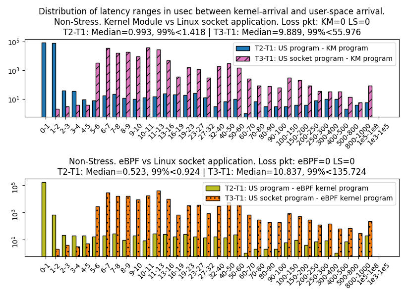
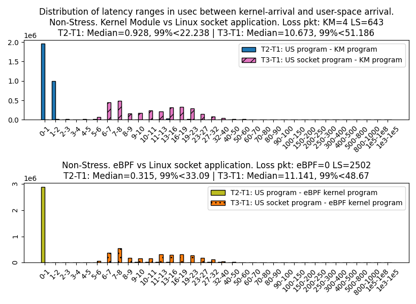

# Final version of the thesis
The pdf file locates at `./thesis_B_cs.pdf`.

# Data
Because of data file sizes these are not included here.

# Source code

This is the source code for the experiment conducted during the course of the BSc. Thesis "On reliable execution of applications for Linux using the approach of in-kernel processing".
The programs that are needed for the experiement are:
- 2 example applications written with eBPF (`eBPF_app/eBPF_measure`) and Kernel Module (`mymodule/kernel_module`) methods.
- 1 packet generator (called `client` located in `mymodule/helper`).
- 1 normal Linux socket based `server` in `mymodule/helper`.
- 2 scripts to process the log files, located in `mymodule/scripts`.

These programs were written on and for `Ubuntu 20.04.2 LTS Desktop 5.8.0-63-generic`.
Please consume the Thesis for how to setup and arrange the test machine and client machine. 
In this source code, the test machine's IP is `192.168.1.24`, client machine's IP is `192.168.1.12`.

The header `mymodule/common.h` defines most of the parameters: paths, buffer sizes, packet sizes, packet structure ...
Both kernel module app and eBPF app make use of this header.
Unfortunately, lots of these params are hard-coded and therefore need to be adapted to new environment (especially the paths, IP addresses and NIC name). 

# How to compile and run the test for the kernel module application:

Install dependencies and toolings:
```bash
sudo apt install build-essential
# Install kernel headers:
sudo apt install linux-headers-$(uname -r)
```

Make and run. There is a Makefile in the `mymodule` folder that defines the rules for the compilings.
```bash
cd mymodule
# km: kernel module program. 
# kmup: the Userspace Processing program.
# s: the linux socket Server.
make km kmup s

# Open 1 terminal window for each program
# Insert the kernel module:
cd mymodule/kernel_module
sudo insmod intercept-module.ko

# Run the user-processing program
sudo ./user

# server: 
cd mymodule/helper
# The km here means the log file name will be KM_socket_server.txt
./s km
```

Now, start the packet generator with `./helpers/c` on the client machine.
In the `mymodule/common.h`, 
the symbol `CLIENT_RATE` defines "how many packets get sent before the client goes to sleep for 1usec", 
which was used to control the sending rate. 
```c
if ((CLIENT_RATE != 0) && (count_i % CLIENT_RATE == 0))
    usleep(1);
```

There are also params for number and size of packets that might need to be changed.
After the client had done sending, the server will automatically terminate and export the log file. 
The user-space processing program need to be terminated by hand (CTRL+C). 
The kernel moule can be unloaded with `sudo rmmod intercept-module`. 

# How to compile and run the test for the kernel module application:
The eBPF app was built with compile environment from `https://github.com/xdp-project/xdp-project`.
Install dependencies and toolings as required in the repo.

After that, copy the folder `eBPF_app/eBPF_measure` into the XDP-project root folder.

Make and run:
```bash
cd eBPF_measure
make clean && make

# Run the eBPF user-space program. 
# The kernel program will be automatically added
# Note that "-d ens33" specifies the network interface name.
sudo ./ebpf_measure_user -d ens33 --filename ebpf_measure_kern.o

# server: 
cd mymodule/helper
# The ebpf here means the log file name will be EBPF_socket_server.txt
./s ebpf
```

After the client had terminated, the server will exit and export log file. 
Terminate the eBPF user-space program by `CTRL+C`. The kernel program is also removed automatically. 

# How to use the scripts to process log files and export data:
Refer to the document for the structure of the test cases. 

There are 2 exporting-scripts, locaed in `mymodule/scripts/`. These script will process log files from `mymodule/logs/test_suit`.

Install deps:
```bash
# linux
sudo apt install python3.8-venv
sudo apt install python3-pip
python3 -m venv venv
. venv/bin/activate
pip3 install matplotlib numpy 
# Successfully installed cycler-0.10.0 kiwisolver-1.3.1 matplotlib-3.4.3 
# numpy-1.21.2 pillow-8.3.1 pyparsing-2.4.7 python-dateutil-2.8.2 six-1.16.0
# IF "Matplotlib is currently using agg, which is a non-GUI backend, so cannot show the figure."
sudo apt install python3-tk
```

- `ps_combi_2_stress_non.py`: Process test-case-wise
    <p align="center">
        
    </p>
- `process_suit_combi_4.py` : Combine all the test files and export
    <p align="center">
        
    </p>

# Acknowledgement and License
These programs were written using lots of other repos, blogs and resources. These can be named are:
- Kernel module to register rx_handler with netdevice https://github.com/G5unit/lkm_rx_handler. We used the code to capture the packets in our module. (GPL3)
- Kernel module to expose mmap memory to user space https://github.com/cirosantilli/linux-kernel-module-cheat/blob/master/kernel_modules/mmap.c. We use this code to exchange packet payload with userspace program. (Unknow license)
- The initiate code is taken from https://github.com/xdp-project/xdp-tutorial/tree/master/advanced03-AF_XDP. This includes build configuration, helper functions, ... (Unknow license)

Because this work is part of our thesis, there might be legal conditions/constraints that could effect how this work can be distributed/used in/for other work.
However, if we are free to chose a license, that would be the CRAPL (`https://matt.might.net/articles/crapl/`), which is partly created to `absolve authors of shame, embarrassment and ridicule for ugly code`. A copy of the license can be found in `./CRAPL.license`.

